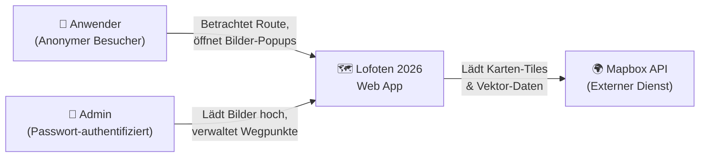
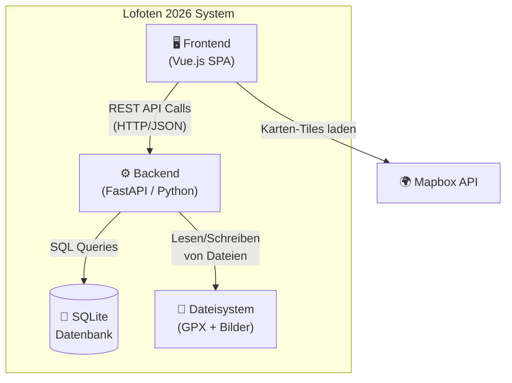
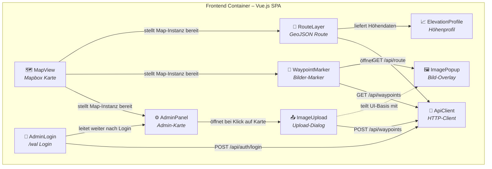
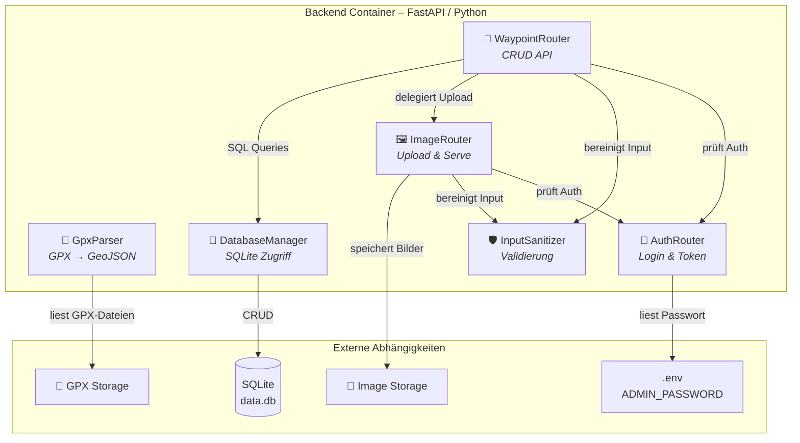
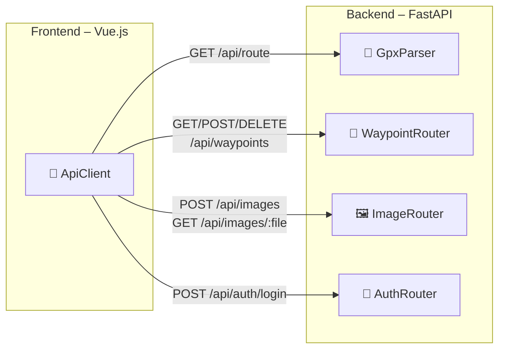

# C4 Modell – Lofoten 2026 Web App

Dieses Dokument beschreibt die Architektur der Lofoten 2026 Webapp auf den C4-Ebenen **Context**, **Container** und **Component**.
Die Entscheidungen basieren auf dem [developer_dialog.md](../Context/developer_dialog.md).

---

## Level 1 – System Context

Wer interagiert mit dem System und welche externen Abhängigkeiten gibt es?

| Akteur / System | Beschreibung |
|:---|:---|
| **Anwender** | Anonymer Besucher, der die Route auf der Karte betrachtet und Bilder-Popups öffnet. |
| **Admin** | Authentifiziert sich über `/wal` mit einem Passwort und kann Wegpunkte mit Bildern auf der Karte platzieren. |
| **Mapbox API** | Externer Kartendienst, der Vektor-Tiles und Styling-Ressourcen bereitstellt. |

---

## Level 2 – Container

Aus welchen deploybare Einheiten besteht das System?

| Container | Technologie | Beschreibung | Komponenten |
|:---|:---|:---|:---|
| **Frontend** | Vue.js + Vanilla CSS | Single Page Application, rendert Karte, Route, Popups und Admin-UI. | [→ Komponenten](frontend/) |
| **Backend** | FastAPI (Python) | REST API für GPX-Parsing, Bild-Upload, Wegpunkt-CRUD und Authentifizierung. | [→ Komponenten](backend/) |
| **Datenbank** | SQLite | Speichert Wegpunkt-Metadaten (Koordinaten, Beschreibung, Bildpfad). | [→ Schema](database/) |
| **Dateisystem** | OS Filesystem | Persistente Ablage für GPX-Dateien und hochgeladene Bilddateien. | [→ Struktur](filesystem/) |

---

## Level 3 – Component

### Frontend-Komponenten (Vue.js)

| Komponente | Aufgabe | Datei |
|:---|:---|:---|
| **MapView** | Initialisiert und rendert die Mapbox GL JS Karte. | [map_view.md](frontend/map_view.md) |
| **RouteLayer** | Zeichnet die GPX-Route als GeoJSON-Layer auf die Karte. | [route_layer.md](frontend/route_layer.md) |
| **ElevationProfile** | Rendert das Höhenprofil der Route. *(Post-MVP)* | [elevation_profile.md](frontend/elevation_profile.md) |
| **WaypointMarker** | Platziert Bilder-Wegpunkte als Marker auf der Karte. | [waypoint_marker.md](frontend/waypoint_marker.md) |
| **ImagePopup** | Zeigt Bild und Beschreibung in einem Popup mit Blur-Hintergrund. | [image_popup.md](frontend/image_popup.md) |
| **AdminLogin** | Login-Maske unter der Route `/wal`. | [admin_login.md](frontend/admin_login.md) |
| **AdminPanel** | Admin-Ansicht mit Klick-auf-Karte zum Platzieren von Wegpunkten. | [admin_panel.md](frontend/admin_panel.md) |
| **ImageUpload** | Dialog zum Hochladen eines Bildes mit Kurzbeschreibung. | [image_upload.md](frontend/image_upload.md) |
| **ApiClient** | Zentraler HTTP-Client für alle Backend-Aufrufe. | [api_client.md](frontend/api_client.md) |

---

### Backend-Komponenten (FastAPI)

| Komponente | Aufgabe | Datei |
|:---|:---|:---|
| **GpxParser** | Liest GPX-Dateien und konvertiert sie in GeoJSON. | [gpx_parser.md](backend/gpx_parser.md) |
| **WaypointRouter** | REST-Endpunkte für Wegpunkt-CRUD. | [waypoint_router.md](backend/waypoint_router.md) |
| **ImageRouter** | REST-Endpunkte für Bild-Upload und -Abruf. | [image_router.md](backend/image_router.md) |
| **AuthRouter** | REST-Endpunkt für Admin-Authentifizierung. | [auth_router.md](backend/auth_router.md) |
| **DatabaseManager** | SQLite-Verbindung, Schema-Setup und Query-Abstraktion. | [database_manager.md](backend/database_manager.md) |
| **InputSanitizer** | Bereinigung und Validierung aller eingehenden Daten. | [input_sanitizer.md](backend/input_sanitizer.md) |

---

### Datenbank & Dateisystem

| Komponente | Aufgabe | Datei |
|:---|:---|:---|
| **Schema** | Tabellendefinitionen und SQL DDL. | [schema.md](database/schema.md) |
| **GpxStorage** | Konvention für die GPX-Dateiablage. | [gpx_storage.md](filesystem/gpx_storage.md) |
| **ImageStorage** | Konvention für die Bild-Dateiablage. | [image_storage.md](filesystem/image_storage.md) |

---

## Gesamtübersicht – Container-übergreifende Kommunikation

